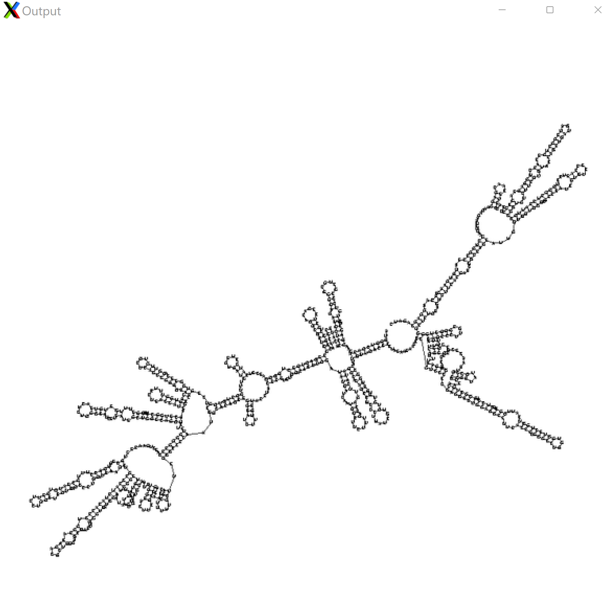

 
  
  <strong>GUI for ViennaRNA</strong>.

#**About the Project**
-------------
 
GUI for ViennaRNA is a
basic GUI that allows users to add sequences either as 
user input or from a file.The user is allowed to select one of the three programs (RNAfold, RNAalifold, RNAplfold).
The PostScript files generated are also displayed in a GUI. 
This is for local ViennaRNA.
 
##**Motivation**
 
To make locally installed ViennaRNA package user-friendly.
 
##**Built with**
 
-Python 3
-tkinter
-Ghostscript
-Pillow
 
##**Build Status**
 
This app only works on Linux. Adaptation to Windows and MacOS will be added. RNAplfold functionality will also be added soon.
 
#**Getting Started**
-------------
**Installation**
 
Before running vienna_guiV5.py script ensure the 
following have been installed:

- ViennaRNA package
- Python 3
- tkinter
- Pillow
- Ghostscript

Ensure that all executables have been updated prior to
running the script and that the vienna_config_v1.py file
is in the same directory.

***********************Warning***************************
The ViennaRNA - RNAfold GUI creates a tmp folder in the
active directory. After quit or close the tmp folder will be 
removed. If you need to save any files please do so prior
to quitting or closing the program.
<!--how to use?-->
 

**Contribute**
If you have suggestions to improve this project or find some issues with it, please fork the repo and create a pull request.
